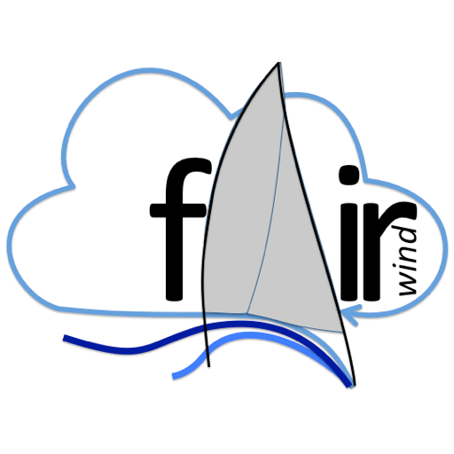

# FairWind-napoli97



An original PRG32 sports-management cartridge set around the **fictional 12-Metre America's Cup held in Naples in 1997**.

The player is both syndicate manager and helmsman. Between races, a compact team-HQ interface inspired by the decision rhythm of modern motorsport-management games handles sponsors, cash flow, technical development, crew, and strategy. On the water, the player helms and trims the yacht from a stern chase view against tactical AI rivals or up to three remote players through PRG32 multiplayer.

## Learn how it is built

[`docs/tutorial/`](docs/tutorial/README.md) is a twelve-chapter, step-by-step tutorial that rebuilds the game for first-year Computer Science and Computer Engineering students taking a C programming course. It covers:
- the game loop and state machines;
- data design;
- fixed-point arithmetic;
- simulated time and the wind;
- sailing physics;
- racing rules and AI;
- 3D graphics from scratch;
- palettes, sprites and the HUD;
- performance engineering on the ESP32-C6;
- multiplayer and testing.

Each chapter has objectives, worked code, self-check questions and graded exercises.

## Campaign

- Choose one of four fictional syndicates.
- Sign sponsors and collect their race retainers.
- Earn prize money according to finishing position.
- Wins unlock richer sponsors and add contractual win bonuses.
- Invest cash in hull efficiency, sails, crew responsiveness, and race strategy.
- Contest five races and win the final championship.

The five venues are based on authored late-1990s console-style pixel panoramas of Santa Lucia and Castel dell'Ovo, Vesuvius, Capri and the Faraglioni, the Sorrento cliffs, and the Naples waterfront/Castel Nuovo. The source and release artwork retains recognizable landmark silhouettes and warm Mediterranean colours; the cartridge renders compact row-compressed counterparts on the race horizon. The procedurally modelled fleet's proportions and deck treatment take **Il Moro di Venezia V (ITA-25), the 1992 America's Cup challenger**, as their period reference: slender deep-red IACC hulls, pale decks and sails, and dark rigs. The four syndicates remain fictional and are distinguished by their trim and spinnaker colours; no real sponsor marks or exact livery are reproduced.

## Multiplayer

Select **Network Multiplayer** on the mode screen. The cartridge joins a PRG32 v8 room dedicated to the selected course through the resident firmware's Wi-Fi/WebSocket snapshot service. Each console owns its local yacht and publishes position, heading, sheet trim, kite state, speed, selected team, course leg, start-line crossing, readiness, and finish state. Up to three remote peers occupy the remaining fleet slots; AI controls only unoccupied or disconnected slots.

The lobby supports two, three, or four human players. Press A to become ready; the race starts when every visible player is ready. Press B to leave the room and race against AI instead. During a race the HUD shows the currently connected fleet count as `NET n/4`.

Rooms are versioned `fairwind-napoli97:v8-<course>`: the v8 snapshot carries position in decimetres, a 9-bit heading, sheet trim, kite type and hoist progress, and boat speed, so every console draws remote rigs trimmed to the same breeze. If a peer disconnects, AI takes over the vacated slot.

Requirements:

1. Configure Wi-Fi station mode and `PRG32_MULTIPLAYER_SERVER_URL` in the firmware.
2. Run the official PRG32 MultiplayerServer on the same reachable network.
3. Install the same cartridge revision on all participating consoles.
4. Prefer a different syndicate for each human player so every yacht has a distinct colour and grid position.

## Controls

| Screen | Control | Action |
|---|---|---|
| Menus | D-pad | Navigate or select team/mode |
| Menus | A | Confirm, sign, invest, or continue |
| Team HQ | B | Sell one development level |
| Race | Left | Helm to port |
| Race | Right | Helm to starboard |
| Race | Up | Ease (loosen) the sheets |
| Race | Down | Trim (tighten) the sheets |
| Race | A | Hoist or drop the spinnaker (takes simulated time) |
| Race | B | Hoist or drop the gennaker (takes simulated time) |
| Race | A+B | Take a penalty turn |

Spinnaker and gennaker are mutually exclusive: asking for one while the other is set drops it first and then hoists the new sail. A and B act on release, so pressing both for a penalty never flips a kite.

## On the water

- **Stern chase view.** A perspective camera rides behind and above the stern, looking along the yacht's heading. The venue's late-1990s panorama sits dead downwind on the horizon, low coastal hills continue round the Gulf, and the open horizon lies upwind to the SW.
- **Top view in close quarters.** Within 70 m of a rival or buoy the view switches to a heading-up overhead camera, which returns to the stern view beyond 100 m. At the next mark it draws the three-length zone.
- **Race field and map.** The playing area (1.8 × 1.7 km) is larger than any view. A course-up map at the top right shows the shore, marks, lines, rivals, your heading, the wind and, from Strategy level 2, the laylines to a windward mark.
- **Land.** Naples lies to leeward, the Sorrento cliffs to port and Posillipo to starboard of the upwind course. They are rendered as shore walls and cannot be sailed onto: a yacht driven into them loses all way (`AGROUND`), and the SW race-area limit behaves the same (`AREA LIMIT`).
- **Wind and shifts.** The SW sea breeze oscillates by several degrees on two periods, drifts slowly through the race and pulses in pressure around 8–16 knots. The wind instrument shows true (gold) and apparent (cyan) wind relative to the bow, the true wind speed, and the current shift as a lift (`L`) or header (`H`). The breeze is deterministic, so every console in a room sails the same shifts.
- **Sails.** The boom is carried to leeward by the wind until the sheet stops it, swings across in tacks and slams over in gybes. Sheets eased too far make the sails luff and flutter; trimmed too hard they stall. The HUD trim bar marks the best angle for the current apparent wind with `LUFF`, `GOOD` or `STALL`. Hulls heel to leeward with the breeze.
- **Speed.** Target speed comes from the ORC 12mR polar and is multiplied by the sail plan, trim and syndicate development, then reached through the momentum of a 26-tonne keelboat. Rudder angle turns and brakes; head to wind the yacht coasts to a stop. Expect about 7 knots close-hauled and 8–9 knots reaching in 12 knots of breeze.

## Starting procedure and simulated time

Every race opens with a playable ten-minute pre-start. The first eight simulated minutes run at 20× (`x20` on screen); from the two-minute box entry onwards, and through the race, time runs at 4×, so boat speeds and turning look true to life. The simulation integrates the measured frame time from the firmware clock, so speeds stay true at any sustained frame rate and every console in a room keeps the same race clock. The committee boat and pin buoy define the line while the HUD counts simulated time. A short stereo horn accompanies the warning/class signal and the International Code P preparatory signal. At −2, the fleet must enter the displayed pre-start box through its assigned port or starboard gate. P is removed with a short horn at −1; the class flag is removed with a longer horn at the start.

The yachts begin on the course side and may not enter early. In multiplayer fleets, entry assignments alternate port and starboard. A valid start requires the yacht to have entered the box from its assigned side, be wholly on the pre-start side at or after zero, and then cross toward the course. An early yacht must return before making a valid crossing. The complete starting-line assembly is removed only after the last yacht crosses. The race clock then runs at 4×: a typical race takes 18–25 simulated minutes (about 5–6 minutes of play) within a 45-minute simulated limit.

## Race paths and finishing

The player selects a path on every race briefing screen with Left/Right before pressing A:

- **Windward / Run:** windward buoy, leeward buoy, second windward rounding, then a run to the finish.
- **Olympic Triangle:** windward, wing and leeward marks followed by the traditional additional windward/leeward section.
- **1992 IACC Z:** a compact six-mark zig-zag with beats, broad reaches and a final run, inspired by the reaching/running “Z” course developed for the first IACC generation in 1992.

The next required buoy receives a flashing gold `NEXT` frame. After the last rounding, the highlight moves to the finish buoy and line. The finish is a separate line extending from that buoy to the committee boat; crossing it does not count until the yacht has completed every mark in order. The 1992 inspiration is documented by the [America's Cup historical account](https://www.americascup.com/history/68_THE-CUP-COMES-ROARING-BACK).

The course is laid to the mean south-westerly, matching the common daytime summer sea-breeze regime in the Gulf of Naples, and the map is drawn course-up with that breeze at the top. Wind oscillates around SW rather than wandering through arbitrary directions.

## AI rivals

The AI sails the same physics and controls as the player:

- **Timed start.** Rivals hold outside the line, enter the box through their gate at −2, and wait deep in the box. They leave on a time-distance calculation from the close-hauled polar, easing sheets to meter their speed so they reach the line at the gun.
- **Beats and runs.** Upwind and downwind they sail best-VMG angles. They tack or gybe at their own laylines, on a 5-degree header, when the other tack clearly gains, or before an edge of the field.
- **Mark roundings.** Rivals round marks to port with an offset, hoist the kite that suits the next leg once they're on it, and drop before a leeward mark.
- **Rules.** They keep clear under Rules 10–12, avoid imminent contact even when they hold right of way (Rule 14), and sail into clear water before taking a penalty turn.

## Basic Racing Rules of Sailing

The game enforces a compact deterministic subset of the [World Sailing Racing Rules of Sailing 2025–2028](https://www.sailing.org/racingrules), beginning at the preparatory signal:

- Rule 10: port-tack yacht keeps clear of starboard tack.
- Rule 11: an overlapped windward yacht keeps clear of the leeward yacht.
- Rule 12: a yacht clear astern keeps clear of the yacht ahead.
- Rule 13: a yacht that is tacking keeps clear until established on its new tack.
- Rule 14: contact is slowed and separated immediately.
- Rule 18: the nearer/inside yacht receives mark-room inside the three-length zone.
- Rule 31: touching a course mark incurs a penalty.

The HUD identifies the infringement. Press A+B to take the penalty: the helm is put hard over towards the wind and the yacht turns a full 360 degrees under its own momentum. Unresolved penalties add three simulated minutes at the finish. This is intentionally a playable rules subset, not a protest-hearing simulator.

## Technical profile

- PRG32 portable ABI with multiplayer feature declaration
- Executable footprint below the firmware's **65,536-byte (64 KiB)** cartridge RAM ceiling
- Hard maximum package size: **65,536 bytes (64 KiB)** per architecture variant
- Normal 320×200 cartridge viewport with firmware-owned status bands
- Fixed-point perspective renderer: stern chase camera, camera-space clipping, even-odd polygon fill, painter's ordering
- Procedural Il Moro di Venezia V-inspired yachts: slender deep-red topsides, team-coloured sheer, pale deck, dark rig, and sails that follow wind, trim and heading
- Spinnaker and gennaker in each team's cyan, red, purple, or yellow, with animated hoists and drops
- ORC 12‑Metre polars at 8–16 knots with sail-plan, trim, heel and momentum models
- Deterministic oscillating wind shifts shared by every console in a room
- A 1.8 × 1.7 km race field with a course-up map, shore walls and hard land boundaries
- Automatic heading-up top view within 70 m of a rival or buoy (100 m to return)
- Simulated time: 20× early pre-start, 4× from box entry, with a complete 10/5–4–2–1–start match-racing sequence
- Three selectable paths with active-buoy highlighting and a committee-boat finish line
- Deterministic enforcement of basic RRS 10–14, 18, and 31 with A+B penalty turns
- Five authored late-1990s-style panoramas stored as row-compressed 8-bit indexed landscapes
- Colours chosen on the ILI9341's 6×6×6 palette cube, so hardware and QEMU match
- Eight-voice stereo tracker score
- Allocation-free update/draw loop suitable for the physical ESP32-C6 profile
- Store metadata and ESP32-C6/QEMU variants

## Performance on the ESP32-C6

The race is designed around a measured budget for the physical console (see [`docs/PERFORMANCE.md`](docs/PERFORMANCE.md)):

- **Indexed drawing.** Every fill uses the palette-indexed firmware calls (a `memset` per row on the ILI9341 backend) instead of RGB565 fills, which convert colour per pixel.
- **Less to transfer.** The race header is drawn once and the HUD refreshes at 7.5 Hz, so most frames push only rows 18–179 over the 32 MHz SPI bus. Idle menus draw nothing.
- **Cheap text.** Race text uses the firmware's named colours on black, which the firmware converts cheaply.
- **Measured in the firmware.** The profiling cartridge runs inside the real PRG32 firmware under QEMU with instruction counting.

The cartridge's own work per frame is under 0.6 million instructions even at the worst frame. The estimated frame time is SPI-bound at about 30 fps, where version 4.0.0 would have run at roughly 4–7 fps.

## Build and test

```sh
python3 -m pip install -r requirements-dev.txt
make test
PRG32_ROOT=/path/to/current/PRG32 ./build.sh
```

The build passes both `--portable` and `--multiplayer`. It rejects either generated `.prg32` file if it exceeds 65,536 bytes and produces `dist/FairWind-napoli97-<version>-store.zip`.

`make test` runs the source checks, a `-Werror` host syntax check, and the behavioural harness under ASan/UBSan. Besides the season, fuzz and multiplayer scenarios, the harness measures:
- polar speeds and momentum
- trim, luffing and stalling
- helm direction and turn rate
- spinnaker and gennaker hoist timing and mutual exclusion
- A+B penalty turns
- grounding
- chase/top-view hysteresis
- wind-shift bounds and determinism
- full AI races on all three courses

`PRG32_ROOT=... python3 tools/profile/qemu_profile.py [SECONDS]` measures the per-frame instruction cost inside the real firmware under QEMU (`NULL_GFX=1` isolates the cartridge's own work and counts its draw calls). See `docs/PERFORMANCE.md`.

`make screenshots` (needs a PRG32 checkout for its 8×8 font) runs `tools/host_capture.py`: real `game.c` frames rendered on the host through the 6×6×6 palette, with the player's yacht helmed by the AI autopilot. It refreshes the store screenshot and `release-artifacts/store-screenshots/`. `tools/host_capture.py OUTDIR [COURSE] [VENUE]` dumps a whole race; with `TRACE=1` it also logs every yacht's position, speed, leg, sheet and rudder.

## Store media

- [Gameplay contact sheet](release-artifacts/FairWind-napoli97-gameplay.png)
- [Store screenshot set](release-artifacts/store-screenshots/)
- [Preview video](release-artifacts/FairWind-napoli97-preview-60s.mp4): a 55-second montage of real game frames at 30 fps (`tools/host_capture.py --video`), with the game's own score captured in QEMU
- [All five venues](release-artifacts/FairWind-napoli97-venues.png)

Store screenshots are real frames from `tools/host_capture.py --store`.

## Fiction notice

The Naples 1997 event, teams, sponsors, results, and characters are fictional. Il Moro di Venezia V is used only as a historical visual reference. This project is not affiliated with any real America's Cup organization or syndicate.
